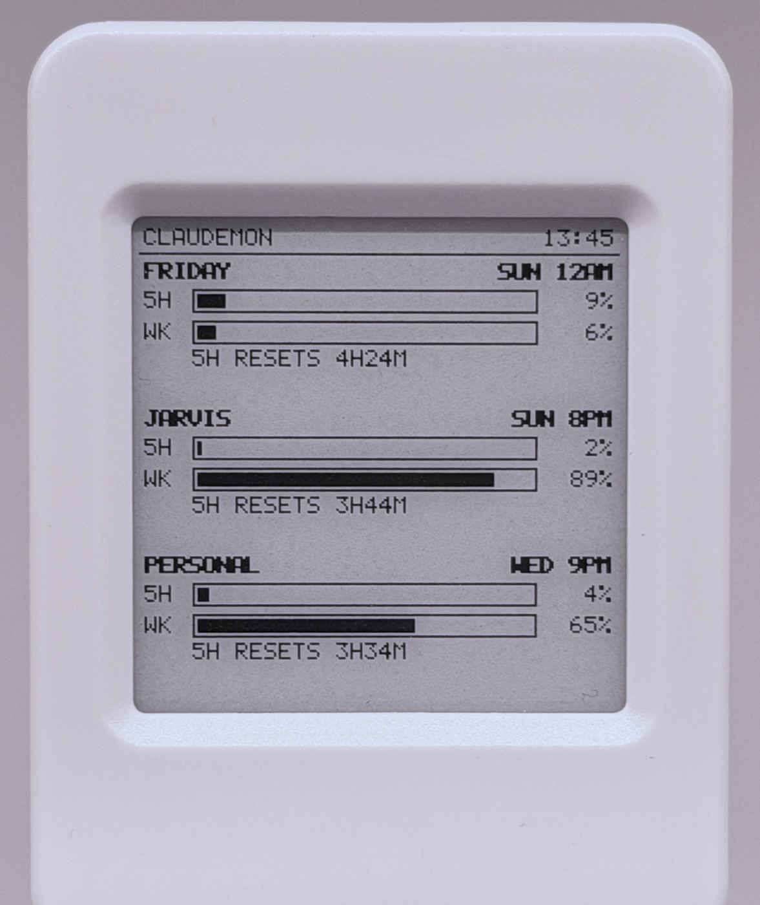
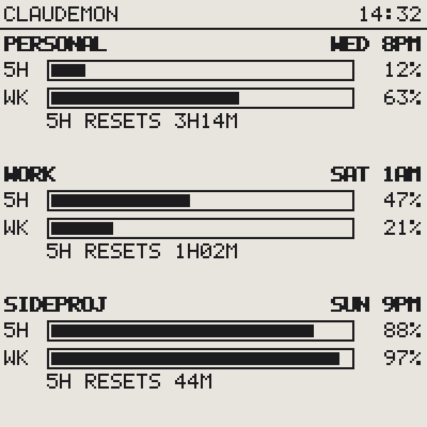

# ClaudeMon

A little e-paper desk display that shows your **Claude subscription usage limits** — the
5-hour session window and the weekly window — for **multiple Claude accounts** at a glance.

<p align="center">
  
</p>

<p align="center">
  
  
</p>

Each account gets a row: bold name, when the weekly window renews (human-readable, local
time), progress bars for the 5-hour and weekly windows, and a countdown to the next 5-hour
reset. A **STALE** banner appears if the host stops pushing for 10 minutes, so the display
never silently lies to you.

> **Disclaimer:** ClaudeMon is a personal, unofficial tool and is **not affiliated with
> Anthropic**. It reads the same undocumented usage endpoint that Claude Code's `/usage`
> panel uses, authenticated with **your own** accounts via OAuth, entirely on **your own**
> machine. The endpoint may change or stop working at any time. Tokens are stored in the
> macOS Keychain and never leave your Mac.

## How it works

```
Claude accounts ──OAuth PKCE──▶ claudemon CLI ──tokens──▶ macOS Keychain
      ▲                                                        │
      │  usage endpoint (per account, every 3 min)             ▼
launchd agent (claudemon run) ──▶ USB serial JSON ──▶ ESP32-S3 e-paper display
```

The Mac does all the work — OAuth, token refresh, polling, string rendering. The ESP32
firmware just receives a small JSON payload over USB serial and draws it. No credentials
ever touch the device.

## Hardware

One board: the **SpotPear / Waveshare ESP32-S3 1.54" e-Paper** (200×200 mono, SSD1681),
about $15–20. See [docs/hardware.md](docs/hardware.md) for purchase links and flashing.

The serial protocol is [documented](docs/protocol.md) — porting the firmware to another
e-paper board only requires reimplementing the display side.

## Quickstart

Requires macOS, [uv](https://docs.astral.sh/uv/), and the board plugged into USB.

```sh
# 1. Install the host tool
uv tool install git+https://github.com/awizemann/ClaudeMon32#subdirectory=host

# 2. Flash the firmware (prebuilt image from Releases — one command)
#    See docs/hardware.md; or build from source with PlatformIO.

# 3. Log in each Claude account you want to monitor
claudemon login personal        # opens a browser; paste the code back
claudemon login work            # use a private/incognito window per account!

# 4. Verify the data path, then push to the display
claudemon status                # terminal table of all accounts
claudemon push-once             # device redraws with live data

# 5. Set and forget
claudemon install-agent         # launchd keeps it running at login
```

`claudemon probe` dumps the raw usage endpoint response — run it if numbers ever look
wrong (the endpoint is undocumented; if the schema drifts, rows show `DATA?` and the raw
JSON is logged).

## Commands

| Command | What it does |
|---|---|
| `login <label>` / `logout <label>` | Add/remove an account (OAuth in browser, tokens → Keychain) |
| `accounts` | List configured accounts |
| `status` | Fetch and print a usage table (`--cached` for the daemon's last snapshot) |
| `probe [label]` | Dump the raw usage endpoint response (schema check) |
| `push-once` | One fetch + one push to the device |
| `run` | The poll/push loop (`--foreground` to watch it) |
| `install-agent` / `uninstall-agent` | Manage the launchd background agent |

## Docs

- **[User guide](docs/guide/README.md)** — [getting started](docs/guide/getting-started.md), [using ClaudeMon](docs/guide/using-claudemon.md), [FAQ](docs/guide/faq.md)
- [Hardware & flashing](docs/hardware.md)
- [Serial protocol](docs/protocol.md) — port the display side to other boards
- [Architecture](docs/architecture.md) — auth model, refresh cadence, failure handling
- [Troubleshooting](docs/troubleshooting.md)

Display mockups in this README are generated pixel-for-pixel from the firmware's own
drawing code: `uv run docs/tools/mockup.py`.

## License

ClaudeMon is [MIT-licensed](LICENSE). The firmware links third-party components
under their own licenses — ArduinoJson (MIT), NimBLE-Arduino (Apache-2.0), the
arduino-esp32 core (LGPL-2.1), and SSD1681 waveform tables from the display
vendor's MIT-style demo code. Full notices, including how the prebuilt release
binaries satisfy the LGPL rebuild requirement (this repo *is* the complete
corresponding source): [docs/licenses.md](docs/licenses.md).
