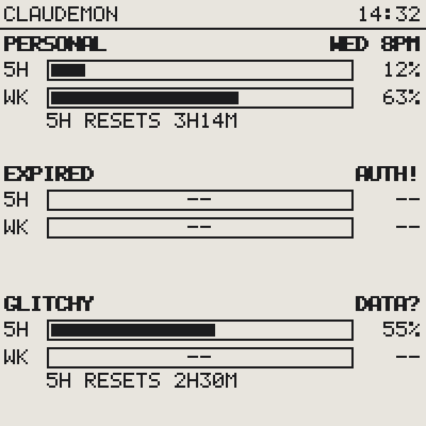

# Using ClaudeMon

## Reading the display


- **Header** — `CLAUDEMON` plus the time of the last push from your Mac.
- **Per account** (up to 4):
  - **Bold name + weekly renewal** — `WED 8PM` is when that account's weekly
    window resets, in your local time.
  - **5H bar** — the rolling 5-hour session window, with percent used.
  - **WK bar** — the weekly window.
  - **5H RESETS 3H14M** — countdown to the next 5-hour reset.

Rows spread out to fill the screen; with 4 accounts the reset line is dropped
to make room.

## Status indicators



| On the display | Meaning | Fix |
|---|---|---|
| `AUTH!` | The account's grant is dead (revoked, password change) | `claudemon login <label>` — picked up within a poll cycle, no restart |
| `ERR` | Repeated fetch failures (network/server) | Usually self-heals; check `claudemon status` |
| `DATA?` | The endpoint returned an unrecognized shape | `claudemon probe <label>`; open an issue with the shape |
| `--` bars | No data for that window yet | Comes with the state above |
| **STALE** banner | No push from the Mac for 10+ minutes | Mac asleep / agent stopped / cable out — see [troubleshooting](../troubleshooting.md#stale-banner) |

The screen does a brief black/white flash every ~15 minutes — that's the
e-paper anti-ghosting full refresh, not a reboot.

## Everyday commands

```sh
claudemon status            # live table (add --cached for the daemon's last snapshot)
claudemon accounts          # list configured accounts
claudemon login <label>     # add an account (private window for extra accounts!)
claudemon logout <label>    # remove one — display updates within a poll cycle
claudemon probe [label]     # raw endpoint response, for debugging
claudemon push-once         # manual fetch + push
claudemon install-agent     # start the background updater (launchd, runs at login)
claudemon uninstall-agent   # stop it (also required before reflashing firmware!)
```

## Cadence, in plain terms

Your Mac checks each account every **3 minutes**, pushes to the display when
something changed (at most every ~2.5 minutes), and heartbeats every 5 minutes
so the display can prove its data is fresh. Numbers on the screen are never
more than a few minutes behind reality while the Mac is awake.

## Logs and files

| Thing | Where |
|---|---|
| Logs | `~/Library/Logs/claudemon/claudemon.log` (self-rotating) |
| Tokens | macOS Keychain, service `claudemon` |
| State cache | `~/.claudemon/state.json` (no secrets) |
