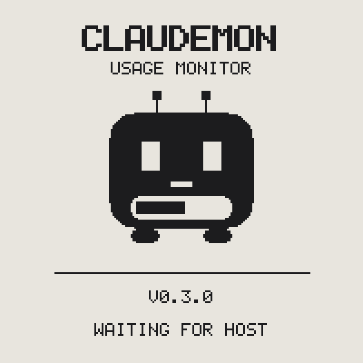

# Getting Started

Time budget: ~20 minutes, most of it waiting for a browser login per account.

## What you need

- A Mac (the host tool uses the macOS Keychain and launchd)
- [uv](https://docs.astral.sh/uv/) installed (`brew install uv`)
- The **SpotPear/Waveshare ESP32-S3 1.54" e-Paper** board (~$15–20; search
  "ESP32-S3 ePaper 1.54") and a **data** USB-C cable — charge-only cables are
  the #1 setup failure
- One or more Claude accounts with a Pro/Max subscription

## 1. Flash the firmware

Download `claudemon-firmware-merged.bin` from the
[latest release](https://github.com/awizemann/ClaudeMon32/releases), plug the
board in, then:

```sh
brew install esptool          # or: uv tool install esptool
ls /dev/cu.usbmodem*          # confirm the board enumerated
esptool --chip esp32s3 --port /dev/cu.usbmodem* write_flash 0x0 claudemon-firmware-merged.bin
```

After the reset you'll see the ClaudeMon mascot and **WAITING FOR HOST**:



No port? Hold the **BOOT** button while plugging in, and see
[troubleshooting](https://github.com/awizemann/ClaudeMon32/blob/main/docs/troubleshooting.md#device-not-showing-up-on-usb).

## 2. Install the host tool

```sh
uv tool install git+https://github.com/awizemann/ClaudeMon32#subdirectory=host
claudemon --help
```

## 3. Log in your accounts

```sh
claudemon login personal
```

A browser opens claude.ai; sign in, then paste the `code#state` the page shows
back into the terminal. Tokens are stored in your Keychain under the
`claudemon` service — completely separate from Claude Code's own credential.

**Adding a second account?** Your browser will silently reuse the session it's
already signed in to. Copy the printed URL into a **private/incognito window**
instead. `claudemon login` warns you if a new login turns out to be a
duplicate of an account it already has.

## 4. Verify, push, and set-and-forget

```sh
claudemon status        # terminal table — numbers should match claude.ai
claudemon push-once     # the display redraws with your accounts
claudemon install-agent # launchd keeps it updating at login, forever
```

Expected `status` output:

```
ACCOUNT   5H USED  5H RESETS  WEEK USED  WEEK RESETS  STATE
-------   -------  ---------  ---------  -----------  -----
personal  12%      3H14M      63%        4D 19H       OK
work      47%      1H02M      21%        6D 2H        OK
```

That's it. The display updates within a couple of minutes of your usage
changing, and shows a STALE banner if the Mac ever stops feeding it.
