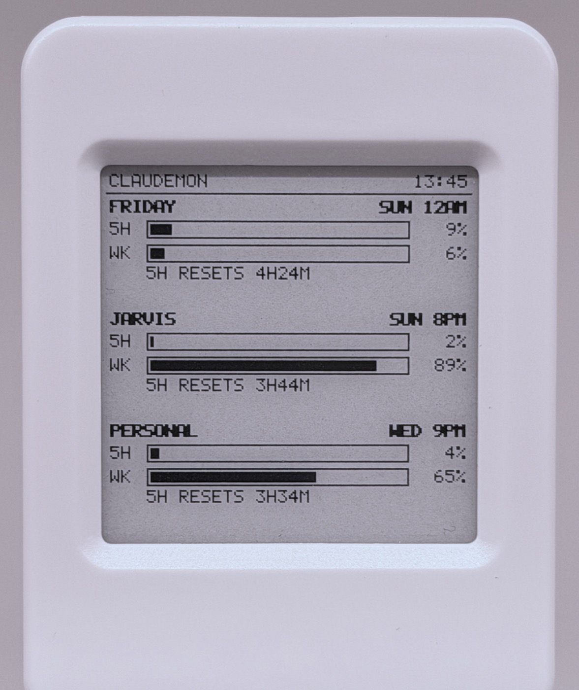

# ClaudeMon User Guide

A little e-paper desk display for your **Claude subscription usage limits** — the 5-hour
session window and the weekly window, for multiple accounts, always visible next to your
keyboard.

## Guide

1. **[Getting Started](Getting-Started)** — parts, flashing, install, first login
2. **[Using ClaudeMon](Using-ClaudeMon)** — reading the display, statuses, commands
3. **[FAQ](FAQ)** — is this official? is it safe? will it break?

## Reference (in the repo)

- [Hardware & flashing](https://github.com/awizemann/ClaudeMon32/blob/main/docs/hardware.md)
- [Serial protocol](https://github.com/awizemann/ClaudeMon32/blob/main/docs/protocol.md) — for porting to other boards
- [Architecture](https://github.com/awizemann/ClaudeMon32/blob/main/docs/architecture.md)
- [Troubleshooting](https://github.com/awizemann/ClaudeMon32/blob/main/docs/troubleshooting.md)
- [Third-party licenses](https://github.com/awizemann/ClaudeMon32/blob/main/docs/licenses.md)

> ClaudeMon is unofficial and not affiliated with Anthropic. It reads an undocumented
> endpoint with your own accounts, on your own machine. Tokens live in your macOS
> Keychain and never leave your Mac.
